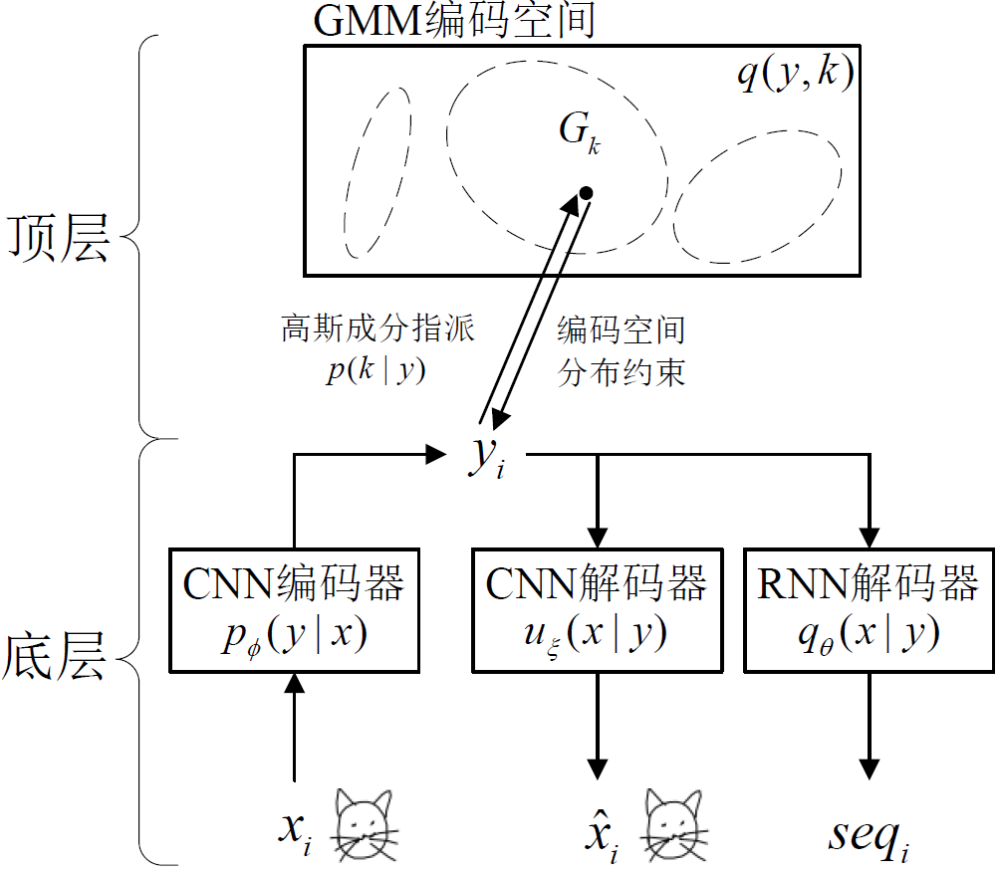
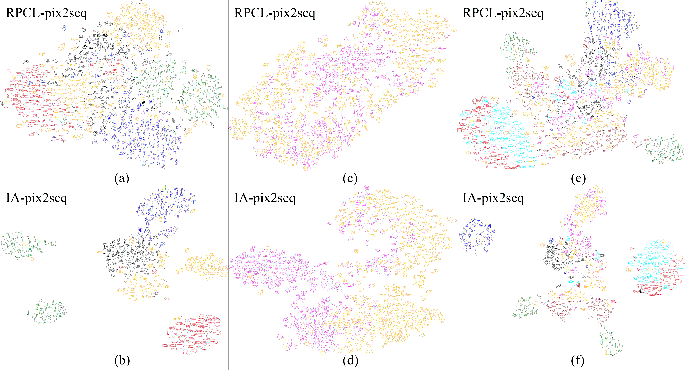

# IA-pix2seq：一个实现简笔画可控生成的深度双向学习方法

简笔画作为一种信息传递和感情表达的媒介，在人类认知发展进程中具有重要意义。其往往呈现抽象、多变、缺乏细节而又不乏生动的特点。即使是表示同一物体类别的简笔画，也会由于绘画者绘制方式（如是否一笔绘制完成简笔画）、概念偏差（简笔画“猪”既可以仅用脑袋，也可以用带完整身体的形象表达）的不同，造成简笔画视觉形态的巨大差异。[RPCL-pix2seq](https://www.sciencedirect.com/science/article/abs/pii/S0893608021000149) 将这些非类别层面的多样性统称为*风格*。简笔画的可控生成，需同时考虑其*类别*和*风格*两方面。

[RPCL-pix2seq](https://www.sciencedirect.com/science/article/abs/pii/S0893608021000149)假设简笔画的编码服从高斯混合模型（Gaussian Mixture Model, GMM）分布，并无监督地将每一种特定类别和风格的简笔画投影到GMM的一个高斯成分中。由此，通过选取不同高斯中的编码，实现可控地生成具有指定特征的简笔画。然而RPCL-pix2seq构建的GMM编码，各高斯成分存在较大重叠。尤其在处理形态相似的简笔画样本时，重叠更严重，可能造成高斯数量的误判。如果选取重叠区域的编码去生成简笔画，可能导致随机产生不同类别与风格的简笔画。若能更紧凑地组织GMM各高斯成分内的编码，拓宽高斯间的边界，可以提升简笔画的可控生成性能。本方法yIng-yAng system pixel to sequence（IA-pix2seq）旨在降低编码空间中的高斯重叠度，以提高简笔画的可控生成性能。

相关论文已投稿至《计算机学报》（ISSN：0254-4164）。IA-pix2seq的源码将在未来公开。

# 概况

IA-pix2seq从外向内将简笔画映射为编码，从内向外解码重建或生成简笔画，是一种[深度双向智能系统](https://ieeexplore.ieee.org/document/8753748)。使用[贝叶斯阴阳和谐学习（Bayesian Ying-Yang (BYY) Harmony Learning）](https://dblp.uni-trier.de/rec/conf/nips/Xu95.html)作为模型训练准则，BYY和谐学习将IA-pix2seq的双向互逆映射以最默契的方式达到最大共识，不仅寻求从内部编码到外部很好地重建或生成简笔画，而且同时从外向内的编码过程是其最优的逆，并且促使整个双向系统复杂度尽量小。具体地，IA-pix2seq不仅能将相同类别和风格的简笔画编码形成紧凑的聚簇，而且能鲁棒地区分形态相似、类别不同的简笔画，保证同一聚簇中简笔画特征的唯一性和一致性，降低编码重叠率，提高简笔画的可控生成性能。其网络结构概览图如下：

# 实验数据集

实验采用的3个数据集均来自[QuickDraw](https://quickdraw.withgoogle.com/data) 。

**数据集1**： 含*蜜蜂*、*公交车*、*花*、*长颈鹿*和*猪*共5个类别，合计350K（1K=10^3）个训练样本、12.5K个验证样本和12.5K个测试样本。

**数据集2**： 含*猫*和*猪*共2个类别，合计140K个训练样本、5K个验证样本和5K个测试样本。猫和猪的最大区别仅在于猫的胡须和猪的鼻子，以直接比较在简笔画细节上的认知把控能力。

**数据集3**： 在数据集1上增加*汽车*、*猫*和*马*共3个类别，合计560K个训练样本、20K个验证样本和20K个测试样本。长颈鹿和马都拥有向左/右朝向的风格特征；猫和猪都拥有一致的面部结构；汽车和公交车都大致呈现左右对称的形态。数据集3集合了更多类别的简笔画，且不同类别间存在一致的风格，进一步增大可控生成难度。

# 编码空间可视化

下图展示了IA-pix2seq与RPCL-pix2seq在数据集1-3上所构造的编码空间。图中黑色、红色、青色、洋红色、蓝色、绿色、棕色和黄色的简笔画分别对应类别蜜蜂、公交车、汽车、猫、花、长颈鹿、马和猪。我们使用[t-SNE](https://www.jmlr.org/papers/v9/vandermaaten08a.html) 实现高维编码空间的可视化。IA-pix2seq的编码空间（子图(b、d、f)分别对应数据集1-3）呈现多个边界清晰、聚合紧凑的聚簇，有效降低了RPCL-pix2seq（子图(a、c、e)）编码高斯间的高重叠问题。

